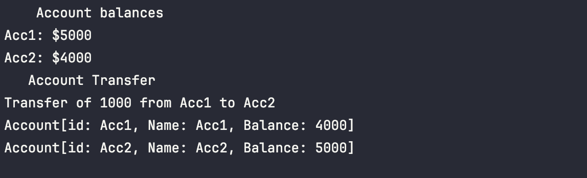
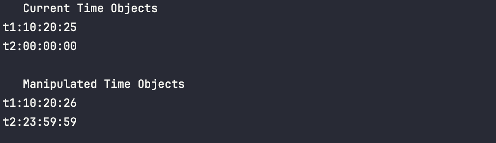

# Advanced Java QAP 1:

**Submitted**: Jan 30, 2025  		**Name**: Jennifer

---

## Reflection Questions:

1. **How many hours did it take you to complete this assessment? Please provide an estimate of the time spent on each part.**
   I spent approximately three hours completing this assessment. The Account class proved to be the most time-consuming, as it presented the steepest learning curve.
2. **What online resources did you utilize to complete this assessment?**
   I primarily relied on the code completed in class during week two, as well as my notes, which were supplemented with assistance from Large Language Models (LLMs), mainly Meta.
3. **Did you collaborate with any classmates to solve problems in this assessment? If so, please mention their name.**
   I received help from Sarah Perry, who walked me through how to read the tables in the assignment while talking about the assignment.
4. **Did you require assistance from any instructors to complete this assessment? If so, please specify the number of questions asked or help sessions required.**
   Jordan provided guidance on general Java concepts, although not specifically related to this assignment.
5. **Rate the difficulty of each question in this assessment from your perspective, and indicate whether you feel confident in applying similar techniques to solve different problems in the future.**
   I feel confident that I can apply the techniques learned in this assignment to solve similar problems in the future. This assignment helped me understand how classes, objects, and methods work together in Java applications.

---

## Exercise1: Account

**TestAccount**.java

```
java

```

```
public class TestAccount {
public static void main (String[] args) {
//init Account objects
Account Acc1 = new Account("Acc1", "Acc1", 5000);
        Account Acc2 = new Account("Acc2", "Acc2", 4000);

        //print account balances:
System.out.println("    Account balances");
        System.out.println("Acc1: $" + Acc1.getBalance());
        System.out.println("Acc2: $" + Acc2.getBalance());

        //transfer balance
System.out.println("   Account Transfer");
        Acc1.transferTo(Acc2, 1000);
        System.out.println("Transfer of 1000 from Acc1 to Acc2");

        //Display new Balances
System.out.println(Acc1.toString());
        System.out.println(Acc2.toString());
    }
}
```



---


## Exercise 2: Date

**TestDate**.java

```
java
public class TestDate {
   public static void main(String[] args) {
      Date date = new Date(30, 1, 2025);
      System.out.println("    Constructed Date:");
      System.out.println(date.toString());
   }
}
```


---

## Exercise 3: Time

**TestTime**.java

```
java
public class TestTime {
    public static void main (String[] args) {
        //establish time objects
        Time t1 = new Time();
        Time t2 = new Time();

        //set time objects
        t1.setTime(21,10,15);
        t1.setHour(10);
        t1.setMinute(20);
        t1.setSecond(25);

        //log current time objects
        System.out.println("   Current Time Objects");
        System.out.println("t1:" +t1.toString());
        System.out.println("t2:" +t2.toString());
        System.out.println();

        //manipulate time objects
        t1.nextSecond();
        t2.previousSecond();

        //log new time objects
        System.out.println("   Manipulated Time Objects");
        System.out.println("t1:" +t1.toString());
        System.out.println("t2:" +t2.toString());

    }
}

```



---
